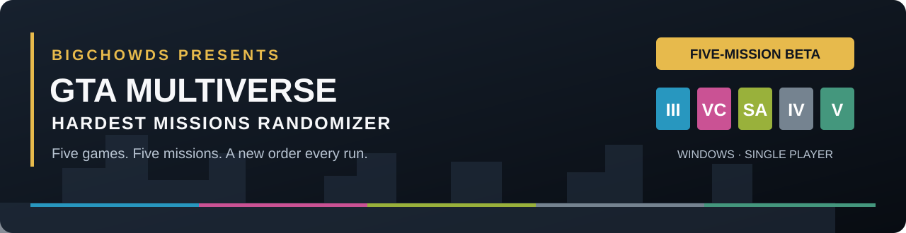

# GTA Multiverse Hardest Missions Randomizer

**Five GTA games. Five missions. A new order every run.**

GHMR is a Windows single-player challenge that switches between GTA games as you complete their selected missions. The first mission comes from the Definitive Edition trilogy; the remaining games are shuffled. Fail a mission and retry the same one.

**Five-mission beta · Controller v0.4.14 · Windows x64**

[Download the beta](https://github.com/bigchowds/GTA-Hardest-Missions-Randomizer/releases) · [Installation](docs/INSTALL.md) · [Report a problem](https://github.com/bigchowds/GTA-Hardest-Missions-Randomizer/issues) · [BigChowds on YouTube](https://www.youtube.com/@BigChowds)

## The five missions

| Game edition | Mission |
|---|---|
| GTA III: The Definitive Edition | Espresso-2-Go! |
| GTA Vice City: The Definitive Edition | Demolition Man |
| GTA San Andreas: The Definitive Edition | Wrong Side of the Tracks |
| GTA IV: Complete Edition | Three Leaf Clover |
| GTA V Enhanced | Derailed |

Classic Trilogy games, GTA V Legacy and multiplayer are outside this beta's supported scope. A complete run requires all five listed editions and compatible game-side scripting runtimes. See the [tested versions and prerequisites](docs/TESTED-COMPATIBILITY.md).

## Get started

1. Download the **Windows release ZIP** from Releases and extract it completely. GitHub's automatic **Source code** ZIP is for contributors, not the playable app.
2. Back up your saves and prepare the [game-specific clean baselines](docs/SAVE-BASELINE.md). **GTA IV needs a pre–Three Leaf Clover save with Packie's marker available**, not an arbitrary 100% save.
3. Install the required scripting runtimes, then launch each game once and close it.
4. Open `GHMR.Controller.exe`, choose **Setup Game Bridges**, and configure/install the bridge for each game.
5. Choose **Start Run** in random-order mode. Select Resume or Story Mode if a game stops at its landing menu. GHMR starts the selected mission after its bridge connects.

The released app includes its .NET runtime. It does not bundle the games, saves, trainers or third-party scripting runtimes. The [installation guide](docs/INSTALL.md) walks through setup.

## What the beta includes

- A fresh five-mission order, with a Trilogy mission first.
- Automatic game handoffs after accepted mission completion.
- Same-mission retry tracking and failure counts.
- Separate **Gameplay Time** and **Real Elapsed** clocks.
- Transition thumbnails and optional music from BigChowds.
- Keyboard/XInput navigation, local diagnostic logs and fixed-order testing in Options.

A successful run displays **Finished — 5/5**. The final game stays open so you can close it normally. **Stop Run** ends the attempt; it does not force-close an unfinished game.

GHMR launches one game at a time. Launcher and game loading screens still take time. Transition media ends when the next game window appears; a short black/startup screen can remain before its menu. Vice City Auto Resume is experimental, and GTA V Story Mode selection can still need your input.

The Derailed result-screen shortcut was tested with an English game window. Keep GTA V in front at **Mission Passed**. Other languages, HDR/exclusive-fullscreen capture and different builds need further community testing. See [troubleshooting](docs/TROUBLESHOOTING.md).

## Timing and fair runs

Use clean, never-cheated baseline saves and remove gameplay-changing tools for a counted attempt. Trainer-assisted debugging is welcome, but those attempts are **QA/unranked**. See the [beta run rules](docs/FIVE-MISSION-BETA-RULES.md).

LiveSplit is optional; no automatic integration is included. GHMR's clocks and accepted completion log are the beta's run record.

## Downloads and trust

The first beta is **unsigned**. **Microsoft Defender SmartScreen** may warn about an unrecognized app; **Windows 11 Smart App Control** can block it and has no per-app allow option. A **Microsoft Defender Antivirus detection** is a separate issue: report its exact threat name, affected file and version rather than assuming it is harmless. Download through this repository's Releases and check the supplied SHA-256. Source and checksums do not bypass Windows protections. Do not disable protection or add broad exclusions to run GHMR. See the [Windows security notice](docs/TRUST-AND-RELEASES.md#unsigned-windows-app).

The Windows package is built by the [public build workflow](https://github.com/bigchowds/GTA-Hardest-Missions-Randomizer/actions/workflows/build.yml) and includes readable bridge scripts, installation docs, a file checksum manifest and build details. [What GHMR does](docs/TRUST-AND-RELEASES.md).

## What's next

The next planned update expands the pool to **10 missions**. **Chaos Mode** is planned after the normal mode is stable, with weapons, vehicles and other modifiers; five additional Chaos missions are being considered. These are plans, not features included in this beta, and there is no release date yet.

Community feedback will guide the next update. For a problem report, include the GHMR version, affected game/build, mission, previous game, what happened and relevant logs. Please remove private paths/account details before posting. [Contributing and reporting](CONTRIBUTING.md).

## Source and credits

[Build from source / development notes](docs/DEVELOPMENT.md) · [Changelog](CHANGELOG.md) · [Media credits](docs/MEDIA-CREDITS.md)

GHMR-authored code is available under the [MIT licence](LICENSE). Media and third-party dependencies retain their own rights and terms. Grand Theft Auto names and game material belong to their respective owners. This is an unofficial fan project, not affiliated with or endorsed by Rockstar Games or Take-Two Interactive.
