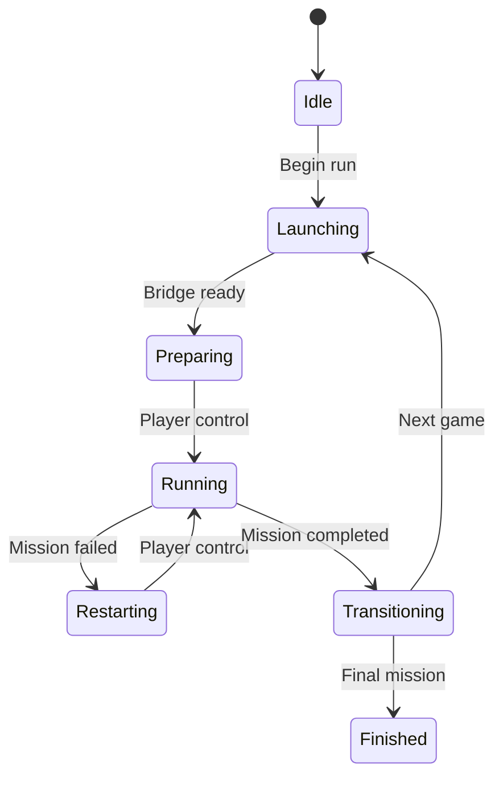

# GHMR Bridge Protocol v1

This document defines communication between the persistent controller and each game-specific bridge. It lets the five games use different modding APIs without leaking those differences into run logic.

## Protocol and transports

- The current SA DE and III DE bridges exchange JSON through one controller INI
  and one game INI per title under `%LOCALAPPDATA%\GHMR\controller\ipc`.
- CLEO Redux's installed IniFiles64 extension reads and writes the game side.
  The controller supplies the per-run session token and verifies game identity.
- Each JSON message is limited to 254 UTF-8 bytes and split across up to three
  100-character values to fit CLEO's 127-byte string boundary. A positive
  sequence publishes a complete frame; the other side acknowledges it before
  the sender reuses the slot. Controller frames also publish their ASCII byte
  length and FNV-1a checksum, so a key-by-key CLEO read can reject a mixture of
  old and new chunks during an in-place Windows file update.
- The original named-pipe simulator remains in source for development and is
  not the active transport in the current Windows controller.
- Local machine only
- One active game bridge at a time
- Every message contains `protocol`, `type` and `messageId`
- Every bridge message also contains a fresh `bridgeSessionId`; run-bound events contain `runId` and `missionId`.

## Bridge handshake

When loaded, a bridge sends:

```json
{
  "protocol": 1,
  "type": "bridgeReady",
  "messageId": "1",
  "game": "vcde",
  "bridgeSessionId": "7b4f74054ba44f0db88ae7ad9a7524ec",
  "bridgeVersion": "0.1.0",
  "executableVersion": "1.0.17.39540"
}
```

The controller rejects an unsupported protocol, bridge or executable version before starting a Normal-mode mission.

## Controller commands

| Type | Purpose |
|---|---|
| `prepareMission` | Load the clean mission setup without starting gameplay time |
| `startMission` | Start the prepared mission when the game is ready |
| `restartMission` | Restart the same mission after failure; never reroll |
| `releaseBridge` | End the completed game's session so the next game can connect |
| `abortRun` | Stop the active run and mark it invalid |
| `ping` | Confirm that the bridge is responsive |

## Bridge events

| Type | Timer effect |
|---|---|
| `gameReady` | No change |
| `missionPrepared` | No change |
| `playerControlGained` | Resume gameplay time |
| `playerControlLost` | Pause gameplay time only for verified loading/transition states |
| `missionFailed` | Record death/failure; retain mission and run order |
| `missionCompleted` | Stop current segment and request the next locked mission |
| `heartbeat` | No change |
| `bridgeError` | Pause and invalidate or recover according to error class |

## Controller states



## Competitive invariants

1. The full mission order is locked before the first mission.
2. Bridges receive only the current mission, never the future order.
3. Failure cannot alter the mission or any Chaos modifiers.
4. A bridge cannot authoritatively change the timer or result file.
5. Controller state is written atomically after every accepted event.
6. Duplicate messages are ignored using `messageId`.
7. Events arriving from a stale process/session are rejected.
8. Loading-time exclusion requires a bridge event and controller-side state validation.
9. A controller restart invalidates an unfinished run rather than resuming it.
10. Gamepad navigation is accepted only while the controller window has focus; game bridges do not bind gameplay buttons.
11. A CLEO JavaScript reload during Retry reuses the game's persisted bridge
    session and last controller command. It reports a missed failure when
    necessary. San Andreas may resume its native checkpoint, while GTA III
    waits for stable free roam and explicitly relaunches only the same locked
    mission index.

## Development sequence

1. Simulated bridge proves shuffling, restart, timer, duplicate-event and stale-session behaviour.
2. San Andreas DE is the first real bridge. It distinguishes completion from
   Retry through either tested story-progress advancement or an increase in
   the engine's `Missions Passed` stat when a baseline is already capped at
   100%. Original mission index `29` has passed controlled launch, failure,
   Retry and completion. The 100%-save path is simulation-tested and awaits
   live confirmation. Indices `73` and `110` are then tested once through that
   real path rather than through another temporary keyboard probe.
3. GTA III DE now has a provisional adapter using mission indices `72`, `73`
   and `79`. Completion requires the selected mission's full scripted reward
   jump; failure requires explicit wasted/busted evidence or Retry-time runtime
   recovery. A raw `ONMISSION` clear never advances or fails the run. The fixed
   route has proven process handoff and direct Espresso-2-Go! launch. A
   story-complete-baseline test reached all nine targets and exposed GTA III's
   return-to-free-roam Retry behavior; v0.1.4's explicit same-index relaunch and
   completion remain to be verified in game.
4. The validated CLEO adapter pattern and protocol are reused for Vice City DE
   with mission-specific completion evidence. A transport implementation is
   reused only after it is proven on the installed builds.
5. GTA IV receives mission-specific evidence because its generic `ONMISSION` value was unsuitable.
6. GTA V connects through ScriptHookVDotNet without changing controller run logic.
